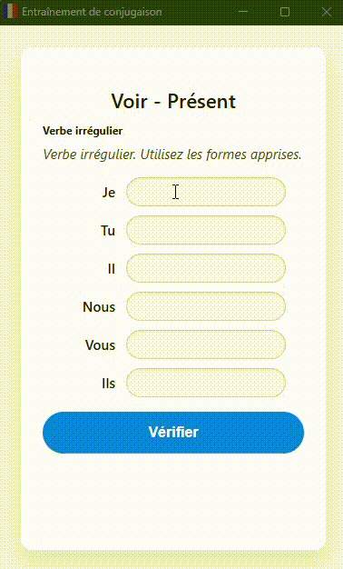

# Entraîneur de verbes français

**Entraîneur de verbes français** est une extension Chrome qui vous aide à pratiquer et à maîtriser la conjugaison des verbes français à travers des quiz interactifs, des règles de conjugaison et des corrections instantanées.

---

## Fonctionnalités

- **Quiz interactif** : Conjuguez des verbes français à différents temps et modes.
- **Correction instantanée** : Les réponses sont vérifiées en temps réel, avec des indications visuelles (vert/rouge).
- **Règles de conjugaison** : Affichage des règles pour chaque temps et type de verbe.
- **Réponses affichées après 3 essais** : Si vous échouez trois fois, les bonnes réponses s’affichent.
- **Navigation rapide** : Utilisez les flèches haut/bas pour passer d’un champ à l’autre.
- **Interface en français** : Toute l’interface et les règles sont en français.
- **Popup automatique** : L’extension s’ouvre automatiquement toutes les 30 minutes pour vous rappeler de pratiquer.
- **Mode manuel** : Lancez un quiz à tout moment via l’icône de l’extension.

---

## Installation

1. **Cloner le dépôt**
   ```bash
   git clone https://github.com/gflima7/french-trainer.git
   cd french-trainer
   ```

2. **Charger l’extension dans Chrome**
   - Ouvrez `chrome://extensions/`
   - Activez le **mode développeur**
   - Cliquez sur **Charger l’extension non empaquetée**
   - Sélectionnez le dossier `french-trainer`

---

## Utilisation

- Cliquez sur l’icône de l’extension pour démarrer un quiz.
- Remplissez les champs de conjugaison pour chaque pronom.
- Les champs deviennent verts si la réponse est correcte, rouges sinon.
- Après 3 tentatives incorrectes, les bonnes réponses s’affichent.
- Cliquez sur **Nouvel exercice** pour un nouveau quiz ou **Fermer** pour quitter.

---

## Personnalisation

- **Ajouter des verbes** : Modifiez `verbs.json` pour ajouter ou retirer des verbes.
- **Modifier les règles** : Modifiez `rules.json` pour adapter ou enrichir les règles de conjugaison.

---

## Déploiement sur le Chrome Web Store

1. Préparez une archive ZIP du dossier de l’extension.
2. Rendez-vous sur le [Chrome Web Store Developer Dashboard](https://chrome.google.com/webstore/devconsole).
3. Téléversez le ZIP, remplissez les informations et soumettez pour validation.

---

## Captures d’écran



---

## Licence

Ce projet est open source sous licence MIT.

---

## Contribuer

Les contributions sont les bienvenues !  
N’hésitez pas à ouvrir une issue ou une pull request pour proposer des améliorations ou corriger des bugs.

---

## Auteur

Développé par Gabriel Lima.

---

**Bon apprentissage et bonne conjugaison